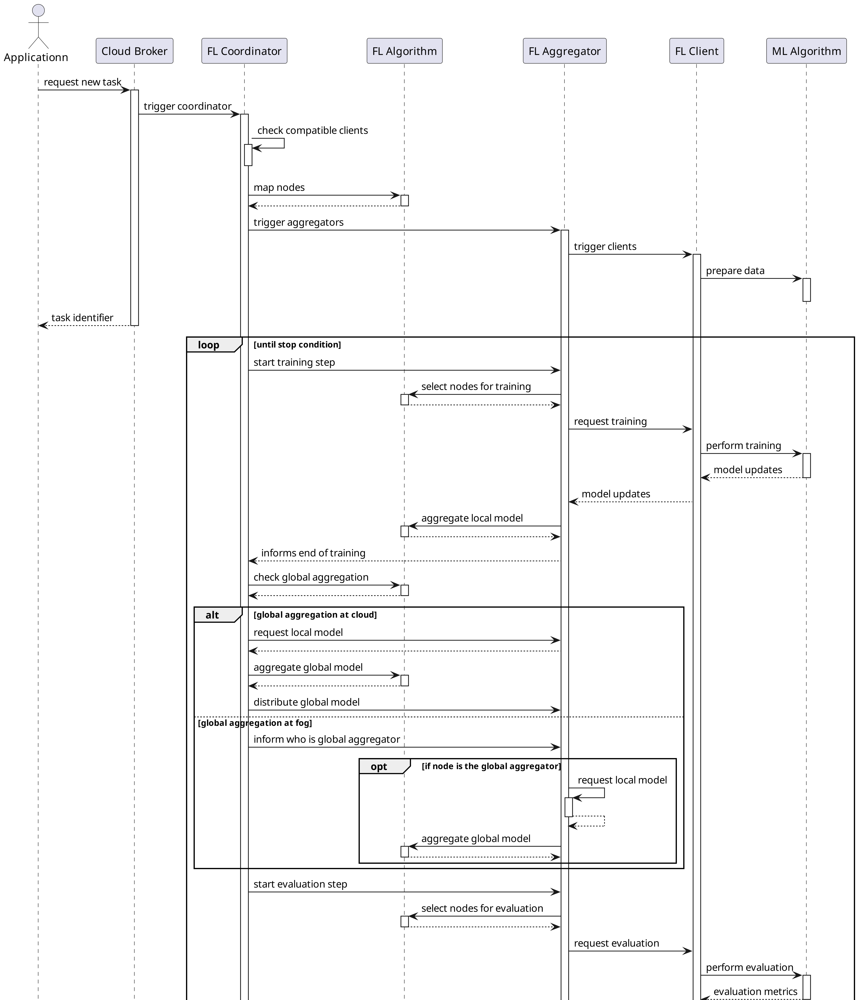
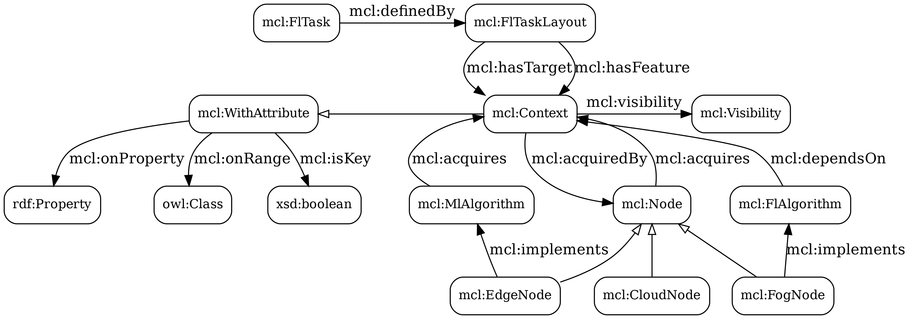

# Micelio: **MI**ddleware for **C**ontext r**E**asoning through federated **L**earning in the **IO**T computing continuum

## Message exchange



## Ontological model



## Simulation

To run a simulation, follow these steps:

- Set the environment variable `NS3_HOME` as the path to your [ns3](https://www.nsnam.org/) root folder.
- If using VSCode, add `"${env:NS3_HOME}/build/include"` to the `.vscode/c_cpp_properties.json` file, at `configurations[].includePath[]`. Example:
```
{
    "configurations": [
        {
            "includePath": [
                "${workspaceFolder}/**",
                "${env:NS3_HOME}/build/include"
            ]
        }
    ]
}
```
- Add a `.env` file to this folder with the following variables:
```
SIM_NAME=micelio
SIM_PROFILE=debug
BUILD_PROFILE=debug
NS3_HOME= 
JENA_FUSEKI_HOME= # path to a folder with Jena prepared to run as a Docker container
JENA_FUSEKI_IMAGE=jena-fuseki-5.2
SIM_PARAMS=data/simulation/both-t20-b100.ttl # simulation parameters file
LIBTORCH= # path to the folder with the torch library 
RESNET_PATH= # path to the pretrained headless resnet18 model
MICELIO_ML_DIRECTORY= # path to a folder where trained models can be saved
```
- Obtain the [trash dataset](https://huggingface.co/datasets/garythung/trashnet) with the images.
    - Run `$ python scripts/prepare-data.py trash /path/to/trashnet-dataset-folder`
- Obtain the [bike dataset](https://s3.amazonaws.com/tripdata/index.html).
    - Run `$ python scripts/compress-data.py /path/to/nyc-citibike-dataset-folder` (use `--help` to check other parameters if needed)
    - Run `$ python scripts/prepare-data.py bikes /path/to/nyc-citibike-dataset-folder` (use `--help` to check other parameters if needed)
- Run `$ make run`.

